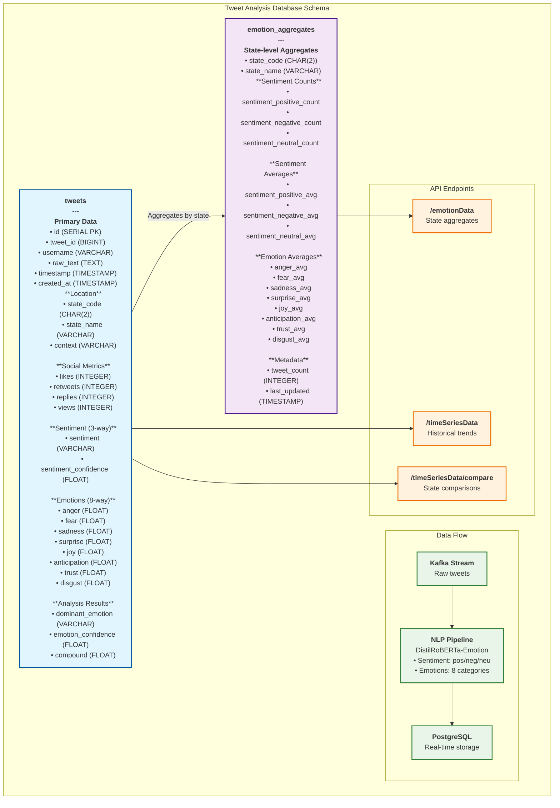

# Database Schema Diagram

Generated: 2026-04-08 15:49:54

## Mermaid Diagram

Copy this code into [Mermaid Live Editor](https://mermaid.live/) or any Mermaid-compatible tool:

## Schema Design Principles

### Sentiment vs Emotions
- **Sentiment**: 3-way classification (positive, negative, neutral)
- **Emotions**: 8-way classification (anger, fear, sadness, surprise, joy, anticipation, trust, disgust)

### Data Flow
1. **Kafka Stream**: Raw tweets from Twitter API
2. **NLP Pipeline**: DistilRoBERTa-Emotion analysis
3. **PostgreSQL**: Real-time storage with proper separation
4. **API Endpoints**: Serve aggregated and time-series data

### Performance Optimizations
- Indexes on timestamp, state_code, sentiment, dominant_emotion
- Automatic aggregation triggers
- Efficient query patterns for real-time dashboards

## Migration Notes
- Old schema mixed sentiment and emotions
- New schema properly separates concerns
- All existing APIs will need updates to use new column names
